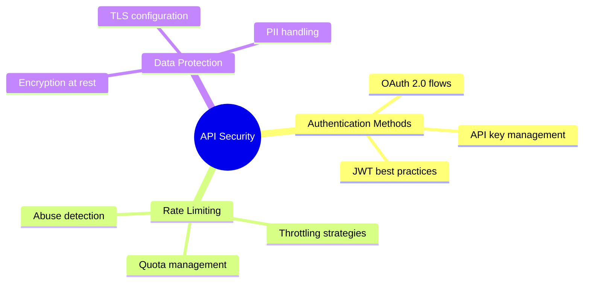

# Content Topology

This reference describes how to derive content types from the domain whirlybird, present topology options to the human, and map whirlybird elements to planned articles.

---

## Content Types from Domain Whirlybird

The domain whirlybird maps the full knowledge domain. Each structural element of the whirlybird corresponds to a potential content type:

| Content Type | Whirlybird Source | Characteristics |
|---|---|---|
| Pillar article | Center + all branches | Comprehensive overview of the entire domain. 2,500-5,000 words. Links to all cluster articles. Serves as the hub page for the topic. |
| Cluster articles | Individual branches | Focused deep-dive into one major theme. 1,500-3,000 words. Links back to pillar. Each branch becomes one cluster article. |
| Targeted pieces | Specific feathers | Tight, focused content answering a specific question or angle. 800-1,500 words. Long-tail keyword targets. Each feather is a candidate. |

### Derivation Rules

**Pillar from center:** The domain whirlybird center defines the pillar article's scope. Every branch the pillar touches becomes a section in the pillar article. The pillar does not go deep on any single branch -- it covers all of them at a moderate level and links out to clusters for depth.

**Clusters from branches:** Each primary branch of the domain whirlybird is a natural cluster article. The branch label becomes the cluster's focus. The feathers under that branch become the cluster article's sections or key arguments.

**Targeted pieces from feathers:** Individual feathers that have enough substance for standalone content become targeted pieces. Not every feather warrants its own article. A feather qualifies for a targeted piece when it addresses a specific question, targets a distinct keyword, or covers a sub-topic the cluster article cannot adequately address in a section.

### Example Derivation

Given this domain whirlybird:



The derivation produces:

- **Pillar:** "The Complete Guide to API Security" -- covers all three branches at moderate depth
- **Cluster 1:** "API Authentication Methods Explained" -- from the Authentication branch
- **Cluster 2:** "Rate Limiting Strategies for APIs" -- from the Rate Limiting branch
- **Cluster 3:** "Protecting Data in API Architectures" -- from the Data Protection branch
- **Targeted piece:** "OAuth 2.0 Authorization Code Flow with PKCE" -- from the OAuth 2.0 feather, if it has enough substance
- **Targeted piece:** "How to Handle PII in REST APIs" -- from the PII handling feather

---

## Content Topology Decision

After the human selects a domain whirlybird, present the topology options using AskUserQuestion.

### Topology Options

```markdown
Based on the domain whirlybird, here are your content topology options:

A) **One pillar article** -- A single comprehensive piece covering the entire domain.
   Best for: Establishing authority on a topic, creating a definitive reference.
   Estimated length: [2,500-5,000 words]

B) **Pillar + clusters** -- One pillar article linking to [N] cluster articles, one per branch.
   Best for: SEO topic hubs, building a content library, thorough domain coverage.
   Estimated total output: [word count estimate across all pieces]

C) **Multiple standalone articles** -- [N] independent articles, each covering one branch.
   Best for: When branches are distinct topics that do not need a hub, or when publishing across different outlets.
   No pillar needed.

D) **Let me study the map** -- Take more time to evaluate the domain whirlybird before deciding.

Which topology fits your goals?
```

Do not proceed to the content plan until the human has made a topology decision.

### Hybrid Topologies

The human may propose a hybrid that does not match the standard options. Common hybrids:

- **Pillar + selected clusters** -- Only some branches get cluster articles. Others are covered adequately in the pillar.
- **Two pillars** -- The domain is large enough to split into two pillar articles, each with its own clusters.
- **Clusters without a pillar** -- The branches are strong enough as standalone pieces. A linking page may replace the traditional pillar.

Accept and plan for any topology the human proposes. The standard options are starting points, not constraints.

---

## Mapping Whirlybird to Content Plan

Once the topology is decided, map each planned article to its whirlybird source:

### Mapping Table Format

```markdown
| Planned Article | Type | Whirlybird Source | Branch/Feather |
|----------------|------|-------------------|----------------|
| [Pillar title] | Pillar | Center + all branches | Entire domain |
| [Cluster A title] | Cluster | Branch 1 | [branch label] |
| [Cluster B title] | Cluster | Branch 2 | [branch label] |
| [Targeted piece title] | Targeted | Feather 2.3 | [feather label] |
```

Every planned article must trace back to a specific element of the domain whirlybird. If an article does not map to the whirlybird, either the whirlybird is incomplete or the article does not belong in this content plan.

---

## Scoping Article-Level Whirlybirds

When an individual article enters the Flowers cycle, it gets its own article-level whirlybird. This whirlybird is scoped to the branch (or branches) the article covers, not the full domain.

For a cluster article covering Branch 2 of the domain whirlybird:
- The article whirlybird center is the branch label
- The article whirlybird branches are the feathers from the domain whirlybird
- Additional feathers may be added from the Madman output for that article

The domain whirlybird stays at the strategy level. Article whirlybirds are created during each article's individual Flowers cycle by the whirlybird skill.
