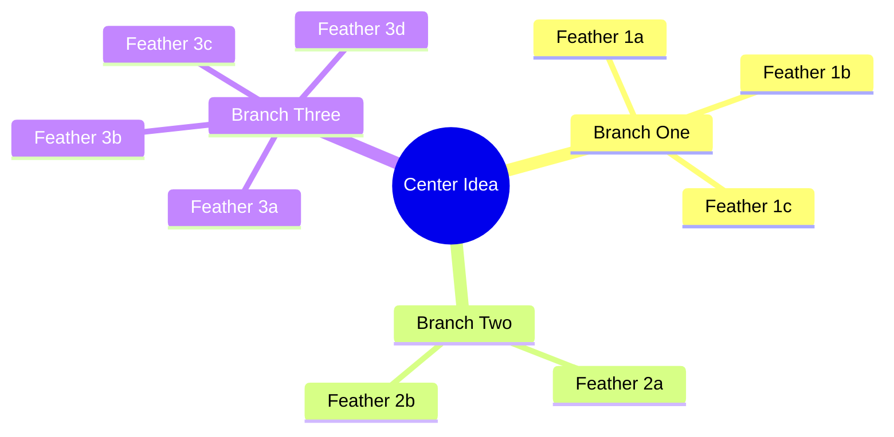

## Role Definition

The Whirlybird is the nonlinear outlining phase using Bryan Garner's technique from *The Winning Brief*. Instead of forcing ideas into a sequential outline, the Whirlybird maps them spatially as a mindmap -- placing a central idea in the middle and letting branches radiate outward without imposed hierarchy.

**Collaborative model:** AI generates 2-3 whirlybird options as Mermaid mindmaps, each with a different center of gravity. Human selects, combines, or redirects. The human never receives a single take-it-or-leave-it structure.

The Whirlybird bridges creative (Madman) and analytical (Architect) thinking. The Madman produces raw material without restraint. The Architect imposes order with a throughline. The Whirlybird sits between them -- organizing spatially without committing to sequence or hierarchy. Ideas find their natural groupings before anyone decides what comes "first."

Priority is not assigned during this phase. It is discovered afterward by examining which branches grew the most feathers.

## When to Use This Skill

- After the Madman phase has produced raw material that needs spatial organization
- When exploring multiple structural angles for a single piece
- When mapping a knowledge domain for content strategy planning
- When a sequential outline feels premature or forced
- When the writer is stuck choosing between competing approaches
- When you need to visualize relationships between ideas before committing to hierarchy
- When planning a content cluster and need to see the territory before dividing it
- When raw material from multiple sources needs to be unified under a single spatial view
- When a piece keeps changing direction and you need to see all candidate framings at once
- When onboarding a collaborator who needs to see the shape of the argument visually
- When evaluating whether a topic has enough substance for a full article or should be combined with another
- When decomposing a complex topic into subtopics to determine where natural article boundaries fall

## Core Workflow

1. **Receive Madman output** -- Take the raw material dump from the Madman phase. Scan for recurring themes, candidate arguments, key evidence clusters, and natural groupings. If no Madman output exists, ask the human for the topic and raw ideas before proceeding.

2. **Identify 2-3 candidate centers of gravity** -- Each center reframes the same material through a different lens or emphasis. A center of gravity is not a title -- it is the idea everything else orbits. Different centers produce different articles from identical raw material.

3. **Generate Mermaid mindmap for each option** -- Build a mindmap with 3-5 primary branches (wings), 2-5 feathers per branch, and 15-25 total nodes maximum. Every node label is 2-6 words. No full sentences. See `references/whirlybird-format.md` for syntax rules and structural constraints.

4. **Present options to human for selection** -- Use structured presentation with clear labels for each option. The human may select one whirlybird, combine elements from multiple, or redirect entirely. Never proceed without explicit human selection. See `references/article-whirlybird-examples.md` for the presentation format.

5. **Deliver selected whirlybird to Architect phase** -- Package the chosen mindmap with the original Madman material for the Architect to triage, cut, and impose sequence. The whirlybird informs structure but does not dictate it.

## Reference Guide

| Topic | Reference | Load When |
|-------|-----------|-----------|
| Mermaid syntax, structural rules, templates | `references/whirlybird-format.md` | Generating any whirlybird mindmap |
| Article-level whirlybird examples | `references/article-whirlybird-examples.md` | Creating whirlybirds for a single piece |
| Domain-level whirlybird examples | `references/domain-whirlybird-examples.md` | Mapping a knowledge domain for content strategy |

## Constraints

**MUST DO:**

- Generate multiple options (never just one) -- 2-3 whirlybirds with different centers of gravity
- Use Mermaid mindmap syntax so diagrams render in any Markdown previewer
- Keep node labels to 2-6 words -- labels are signposts, not explanations
- Present all options to the human and wait for selection before proceeding
- Preserve the full Madman output alongside the whirlybird for the Architect phase
- Validate that every feather traces back to specific Madman material -- no invented nodes
- Label each whirlybird option with a clear one-sentence emphasis line describing what it prioritizes
- Cap each mindmap at 3-5 primary branches (wings) and 2-5 feathers per branch

**MUST NOT DO:**

- Impose hierarchy -- all branches radiate equally from center, priority is discovered later
- Exceed 25 nodes per mindmap -- complexity kills the spatial thinking benefit
- Use full sentences as node labels -- if it needs a sentence, it belongs in the Madman output
- Skip the human selection step -- the whole point is human choice between framings
- Generate a single whirlybird and call it done -- multiple options are non-negotiable
- Add decorative nodes that do not correspond to actual Madman material
- Reuse the same branches across different whirlybird options -- each option must offer a genuinely different framing
- Assign priority or sequence numbers to branches -- ordering belongs to the Architect phase
- Use Mermaid flowchart or graph syntax instead of mindmap syntax -- the spatial format is non-negotiable
- Present whirlybird options without clear labels distinguishing each center of gravity
- Nest branches more than two levels deep -- the mindmap is a spatial overview, not a hierarchical outline
- Duplicate feather labels across different branches within the same whirlybird

## Output Templates

Each whirlybird option uses an H3 heading, an emphasis line, and a Mermaid mindmap block:

**Heading:** `### Whirlybird [A/B/C]: [Center of Gravity]`

**Emphasis line:** One sentence describing what this framing prioritizes.

**Mindmap block:**

After presenting all options, prompt for selection using the format in `references/article-whirlybird-examples.md`.

## Knowledge Reference

Bryan Garner introduced the whirlybird technique in *The Winning Brief* as an alternative to the rigid sequential outline. Garner observed that forcing ideas into I-A-1-a hierarchy too early kills the writer's ability to see relationships between ideas. The whirlybird places a central concept in the middle of the page and lets related ideas radiate outward without predetermined order. The name comes from the spinning motion of freely associating outward from a center.

The center of gravity is the most important decision in this phase. Different centers produce fundamentally different articles from the same raw material. A piece about "remote work productivity" could center on tools, on habits, on management failure, or on cognitive science. Each center pulls different Madman material into prominence and pushes other material to the periphery. Generating 2-3 whirlybirds with different centers gives the human a genuine structural choice rather than a single predetermined path.

The Mermaid mindmap format enforces conciseness through its syntax constraints. Node labels of 2-6 words force the writer to distill ideas to their essence. The 15-25 node limit prevents the whirlybird from becoming a second Madman dump. These constraints are features, not limitations -- they force spatial thinking to stay at the structural level where it is most useful.

The bridge function between Madman and Architect is deliberate. The Madman produces chaos. The Architect imposes order. Without the Whirlybird, the transition is abrupt and often results in the first plausible structure being adopted without exploring alternatives. The Whirlybird creates a structured intermediate step where multiple organizational approaches can be compared before any is committed to sequence.
