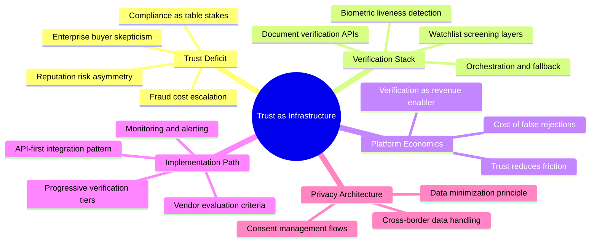
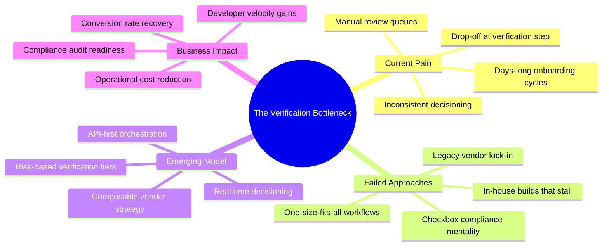
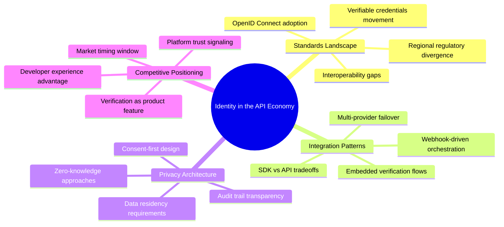

# Article Whirlybird Examples

## Scenario

Writing about API-first identity verification for fintech platforms. The Madman phase produced raw material covering trust deficits, verification technology stacks, regulatory requirements, failed legacy approaches, platform economics, privacy concerns, developer experience, and competitive dynamics.

Three whirlybirds below reframe the same raw material through different centers of gravity.

---

## Whirlybird A: Trust as Infrastructure

**Emphasis:** Positions identity verification as foundational infrastructure that enables everything else. Foregrounds the trust deficit and frames verification technology as the solution layer.



---

## Whirlybird B: The Verification Bottleneck

**Emphasis:** Leads with the pain. Frames current verification as a broken bottleneck that damages conversion, compliance, and user experience -- then presents the emerging API-first model as the resolution.



---

## Whirlybird C: Identity in the API Economy

**Emphasis:** Zooms out to the industry landscape. Positions identity verification within the broader API economy and frames it as a competitive differentiator rather than a cost center.



---

## Selection Prompt

After presenting all three whirlybirds, prompt the human for selection using this format:

```
Which whirlybird best captures your intent for this piece?

Options:
  - Whirlybird A: Trust as Infrastructure -- emphasizes verification as foundational infrastructure that enables platform economics
  - Whirlybird B: The Verification Bottleneck -- emphasizes the broken status quo and the emerging API-first resolution
  - Whirlybird C: Identity in the API Economy -- emphasizes industry landscape and competitive positioning
  - Combine elements (I'll specify)
```

### Handling Responses

**If the human selects one option:** Deliver that whirlybird along with the full Madman output to the Architect phase.

**If the human selects "Combine elements":** Ask which center of gravity to use and which branches from other options to pull in. Regenerate a single combined whirlybird before delivering to the Architect.

**If the human rejects all options:** Ask what angle or emphasis they have in mind. Identify 2-3 new candidate centers and regenerate. Do not reuse the same centers.

---

## What Makes Each Option Different

The three whirlybirds above use the same raw material but produce different articles:

| Option | Likely Article Shape | Reader Takeaway |
|--------|---------------------|-----------------|
| Whirlybird A | Strategic guide for platform leaders | "Verification is infrastructure, not a feature" |
| Whirlybird B | Problem-solution piece for engineering and product leaders | "Your current approach is costing you -- here is the fix" |
| Whirlybird C | Industry analysis for technical decision-makers | "The market is shifting -- here is how to position" |

This is why multiple options matter. The same Madman material supports at least three distinct, publishable articles. The human's selection determines which one gets built.

---

## Evaluating Whirlybird Quality

A well-formed article whirlybird:

- Has a center that could be the article's thesis or core question
- Has branches that represent genuinely different aspects, not synonyms
- Has uneven feather distribution -- at least one branch should be notably deeper than others
- Has labels that a reader could scan and understand the territory in under 30 seconds
- Stays within the 15-25 node constraint without feeling artificially compressed
