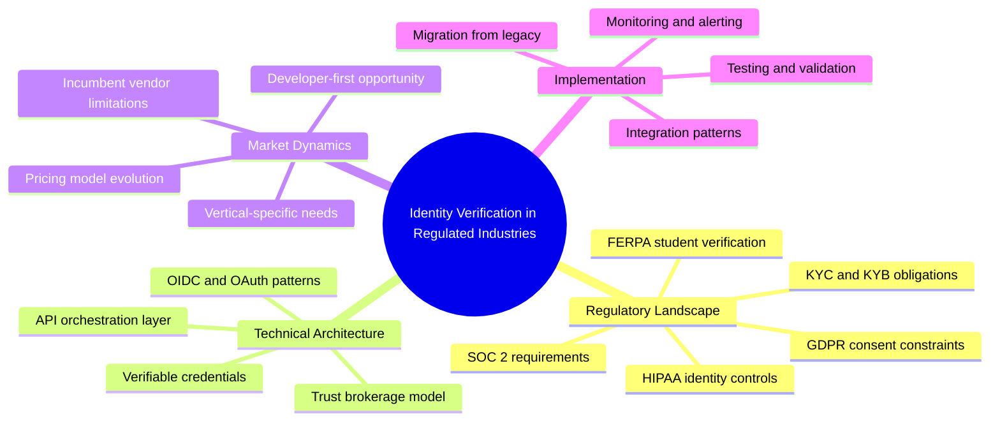

# Domain Whirlybird Examples

## Scenario

Mapping "identity verification in regulated industries" for a multi-article content strategy. The goal is not a single article but a complete content topology -- a map of everything worth writing about in this domain, from which individual pieces are carved.

---

## Domain Whirlybird: Identity Verification in Regulated Industries

---

## Deriving Content Topology from a Domain Whirlybird

A domain whirlybird maps territory. Content topology is how you divide that territory into publishable pieces. The whirlybird's structure directly informs the content hierarchy:

### Pillar Content

**Source:** Center node + all branches combined.

The pillar piece covers the entire domain at survey depth. It touches every branch without going deep into any feather. This is the cornerstone content that everything else links back to.

**Example pillar article:** "The Complete Guide to Identity Verification in Regulated Industries"

This article would cover the regulatory landscape, technical architecture, market dynamics, and implementation at a high level -- one section per branch, referencing deeper cluster articles for detail.

### Cluster A: Regulatory Landscape Deep Dive

**Source:** Branch 1 and its feathers.

Each feather becomes a candidate article. The cluster covers the branch comprehensively.

| Feather | Article Candidate |
|---------|-------------------|
| SOC 2 requirements | "SOC 2 Identity Verification: What Auditors Actually Check" |
| HIPAA identity controls | "HIPAA-Compliant Identity Verification for Digital Health Platforms" |
| KYC and KYB obligations | "KYC vs KYB: Identity Verification Requirements for Fintech" |
| FERPA student verification | "Student Identity Verification Under FERPA: A Technical Guide" |
| GDPR consent constraints | "GDPR Consent and Identity Verification: Navigating the Tension" |

**Cluster hub article:** "Navigating the Regulatory Landscape for Identity Verification" -- connects all five feather articles and maps the regulatory territory.

### Cluster B: Technical Architecture Deep Dive

**Source:** Branch 2 and its feathers.

| Feather | Article Candidate |
|---------|-------------------|
| OIDC and OAuth patterns | "OpenID Connect for Identity Verification: Beyond Authentication" |
| Verifiable credentials | "Verifiable Credentials in Practice: Moving Beyond the Spec" |
| API orchestration layer | "Building an Identity Verification Orchestration Layer" |
| Trust brokerage model | "Trust Brokerage: A New Architecture for Multi-Provider Verification" |

**Cluster hub article:** "Technical Architecture for Modern Identity Verification" -- covers the architectural decisions that connect OIDC, verifiable credentials, orchestration, and trust brokerage.

### Cluster C: Market Dynamics Deep Dive

**Source:** Branch 3 and its feathers.

| Feather | Article Candidate |
|---------|-------------------|
| Incumbent vendor limitations | "Why Legacy Identity Verification Vendors Are Losing Ground" |
| Developer-first opportunity | "The Developer-First Identity Verification Market Gap" |
| Vertical-specific needs | "One Size Does Not Fit All: Vertical Identity Verification Needs" |
| Pricing model evolution | "From Per-Check Pricing to Platform Fees: Identity Verification Economics" |

### Cluster D: Implementation Deep Dive

**Source:** Branch 4 and its feathers.

| Feather | Article Candidate |
|---------|-------------------|
| Integration patterns | "Identity Verification Integration Patterns: Embedded, Redirect, and Hybrid" |
| Migration from legacy | "Migrating from Legacy Identity Verification Without Downtime" |
| Testing and validation | "Testing Identity Verification Flows: A Practical Framework" |
| Monitoring and alerting | "Monitoring Identity Verification in Production: What to Watch" |

### Targeted Content: Single-Feather Pieces

**Source:** Any individual feather treated as a focused, standalone piece.

Not every feather needs a cluster context. Some feathers stand alone as tightly scoped articles targeting a specific keyword, audience segment, or use case.

**Examples:**

- "SOC 2 Identity Verification: What Auditors Actually Check" -- targets compliance officers searching for audit preparation guidance
- "Building an Identity Verification Orchestration Layer" -- targets platform engineers evaluating build-vs-buy decisions
- "The Developer-First Identity Verification Market Gap" -- targets founders and product leaders evaluating market positioning

Targeted content is carved directly from a single feather. It does not attempt to cover the branch or cluster. Its value is depth and specificity.

---

## Domain Whirlybird vs Article Whirlybird

| Dimension | Article Whirlybird | Domain Whirlybird |
|-----------|--------------------|-------------------|
| Center | Article thesis or core question | Knowledge domain or topic area |
| Branches | Arguments or content sections | Theme areas or content clusters |
| Feathers | Supporting points and evidence | Individual article topics |
| Output | Input for Architect phase | Content topology for strategy |
| Scope | One piece of writing | Multi-article content plan |
| Human decision | Which angle for this article | Which clusters to prioritize |

---

## When to Use a Domain Whirlybird

- Planning content for a new product launch or market entry
- Building a content library around a technical domain
- Mapping competitive content territory to find gaps
- Creating an editorial calendar from scratch
- Assessing whether a topic area has enough depth for sustained publishing

The domain whirlybird answers the question: "What is everything we could write about in this space?" The editorial strategy that follows answers: "What should we write first, and why?"
