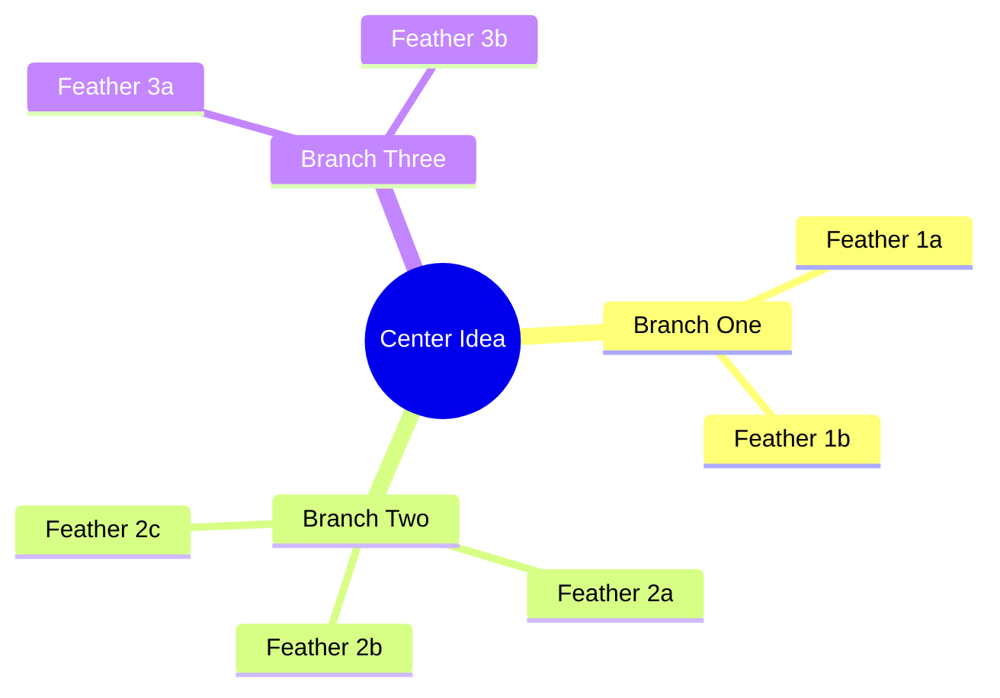
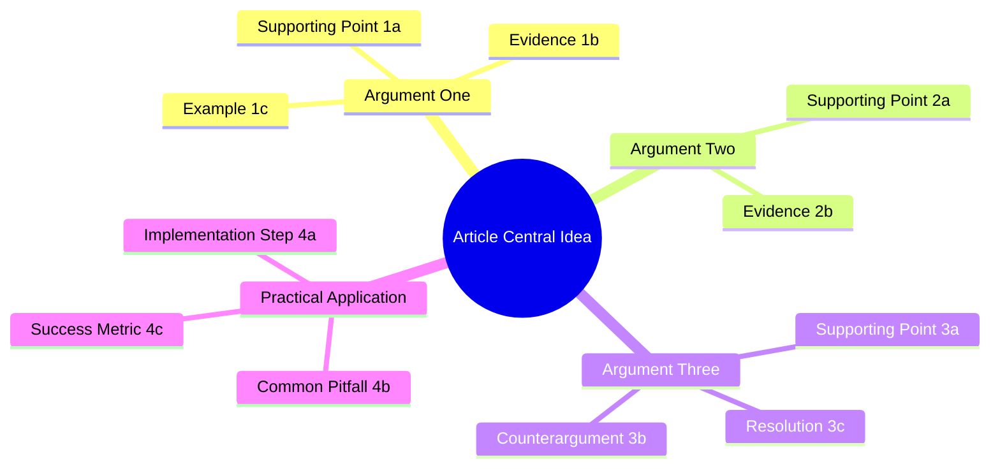
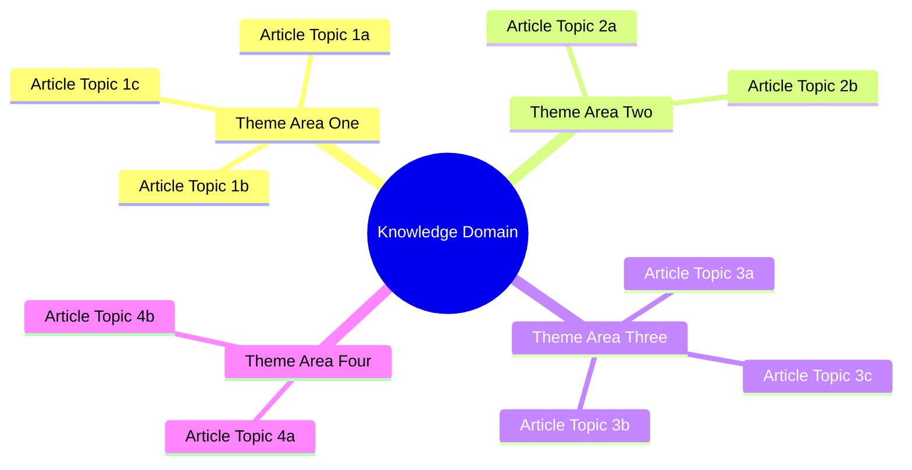

# Whirlybird Format Reference

## Mermaid Mindmap Syntax

The whirlybird uses Mermaid's `mindmap` diagram type. Every whirlybird follows the same structural skeleton:



### Node Types

| Node | Syntax | Usage |
|------|--------|-------|
| Center (root) | `root((Center Idea))` | Double parentheses. The idea everything orbits. |
| Primary branch | `Branch Name` | Indented under root. The "wings" of the whirlybird. |
| Feather | `Feather Name` | Indented under branch. Supporting points, evidence, sub-topics. |
| Sub-feather | `Sub-feather Name` | Indented under feather. Use sparingly and only when genuinely needed. |

### Indentation

Mermaid mindmaps use indentation to define hierarchy. Each level is indented with two additional spaces:

```
mindmap
  root((Center))        <- level 0 (root)
    Branch               <- level 1 (primary branch)
      Feather            <- level 2 (feather)
        Sub-feather      <- level 3 (sub-feather, use sparingly)
```

## Structural Rules

### Size Constraints

| Element | Minimum | Maximum |
|---------|---------|---------|
| Primary branches (wings) | 3 | 5 |
| Feathers per branch | 2 | 5 |
| Total nodes (all levels) | 15 | 25 |
| Words per node label | 2 | 6 |

### Node Labels

Labels are signposts, not explanations. They must be short enough to scan visually.

**Good labels:** "Trust deficit in fintech," "API orchestration layer," "Regulatory compliance cost"

**Bad labels:** "The growing trust deficit between fintech platforms and enterprise customers," "How to build an API orchestration layer," "Regulatory compliance is expensive and slow"

If a label needs more than 6 words, it is too detailed for the whirlybird. Push that detail into the Madman output or a downstream reference.

## Core Properties

1. **No hierarchy imposed** -- All branches radiate equally from the center. No branch is "first" or "most important" at this stage. Priority is discovered later by examining which branches grew the most feathers and which feathers carry the most weight.

2. **Branching reveals depth** -- A branch with many feathers signals more substance, more evidence, more to say. A branch with only one feather may need to merge into another branch or may signal a gap in the Madman material.

3. **Bridges creative and analytical thinking** -- The Madman produces chaos. The Architect imposes order. The Whirlybird provides the transitional structure: organized enough to see patterns, loose enough to rearrange without friction.

4. **Encourages unexpected connections** -- Spatial layout makes relationships visible that sequential lists hide. Two feathers on different branches may belong together. A branch that seemed minor may turn out to be the real story.

5. **Makes getting started easy** -- There is no pressure to decide what comes "first." Write the center, then add branches in any order. Add feathers wherever they fit. The whirlybird grows organically instead of demanding top-down decisions.

## Two Contexts

### Article Whirlybird

Used when structuring a single piece of writing.

- **Center:** The article's central idea, thesis, or core question
- **Branches:** Major arguments, sections, or content areas
- **Feathers:** Supporting points, evidence, examples, sub-arguments

The article whirlybird produces input for the Architect phase, which will impose sequence, cut excess, and build a linear blueprint.

### Domain Whirlybird

Used when mapping a knowledge domain for content strategy.

- **Center:** The knowledge domain or topic area
- **Branches:** Major theme areas or content clusters
- **Feathers:** Individual article topics, sub-themes, specific angles

The domain whirlybird produces a content topology -- a map of everything you could write about, from which individual articles are carved.

## Article Whirlybird Template



## Domain Whirlybird Template



## Common Mistakes

| Mistake | Fix |
|---------|-----|
| Too many nodes (30+) | Cut to 15-25. If the whirlybird is too dense, it loses the spatial thinking benefit. Split into two whirlybirds or promote feathers to separate branches. |
| Nodes are full sentences | Shorten to 2-6 word labels. The whirlybird is a map, not a draft. |
| Only one feather per branch | Merge into another branch. A single-feather branch is either underdeveloped or redundant. |
| All branches have equal feathers | Investigate -- one branch should have more depth. If they are perfectly balanced, the center of gravity may be too vague. |
| Sub-feathers everywhere | Keep high-level. Sub-feathers are for genuine subdivisions, not for cramming in detail. If every feather has sub-feathers, the whirlybird is too granular. |
| Center too broad | Narrow it. "Technology" is not a center. "API-first identity verification" is. |
| Center too narrow | Broaden it. "OAuth token refresh timing" is too narrow for a whirlybird. "Identity verification architecture" gives room for branches. |
| Branches overlap | Redraw boundaries. If two branches share feathers, they may be the same branch viewed from different angles. Merge and redistribute. |
| Sequential numbering on branches | Remove numbers. Branches are spatial, not sequential. Numbering defeats the purpose. |
